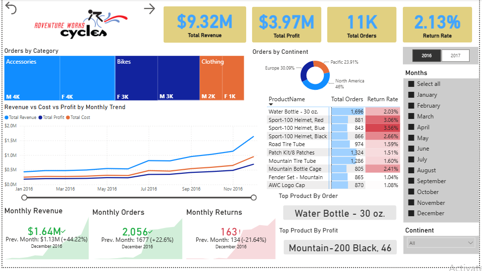
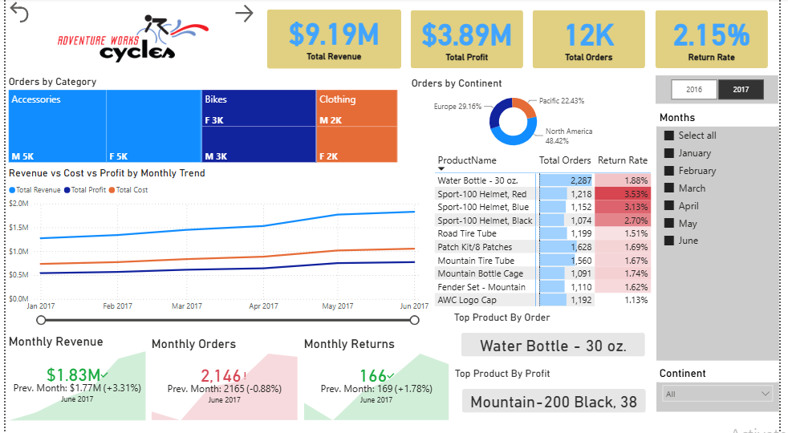
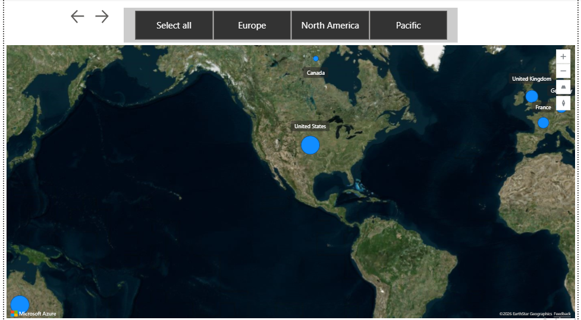
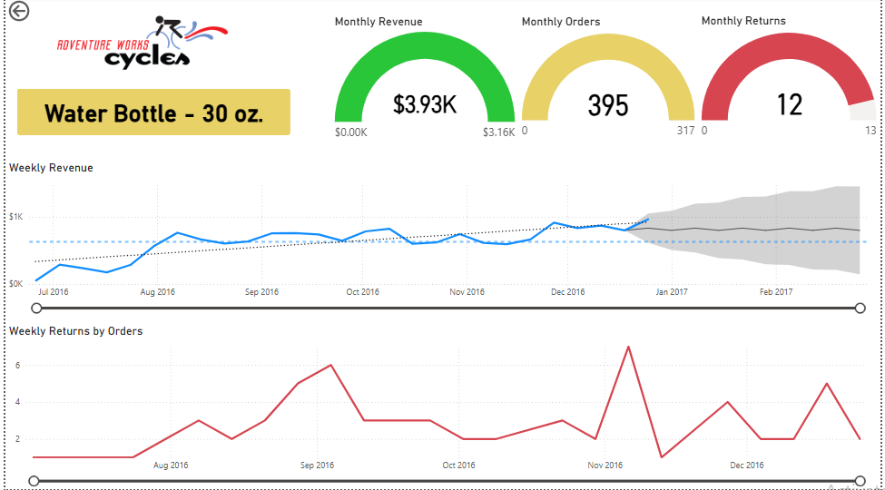
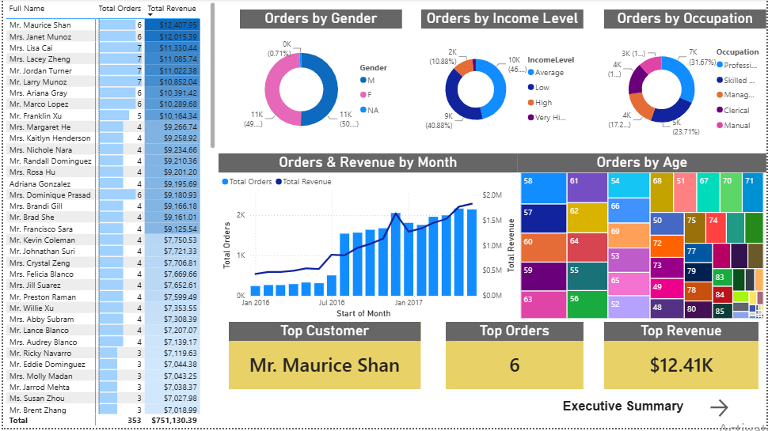

# Power BI Sales Performance Dashboard

## Project Overview

This project was completed as part of the Data Analytics & Business Intelligence course at DigiSkills.pk.

The dashboard transforms raw sales data into actionable business insights through interactive visualizations, KPI tracking, customer analysis, product performance evaluation, and geographic reporting.

## Key Metrics

- Total Revenue: $9.32M
- Total Profit: $3.97M
- Total Orders: 11K
- Return Rate: 2.13%

## Executive Summary (2016)

## Executive Summary (2017)

## Geographic Analysis

## Product Analysis

## Customer Analysis

## Tools & Technologies

- Power BI
- Power Query
- DAX
- Data Modeling
- Data Visualization

## Author

Sujata Lohana

Aspiring Data Analyst | Power BI | SQL | Excel
